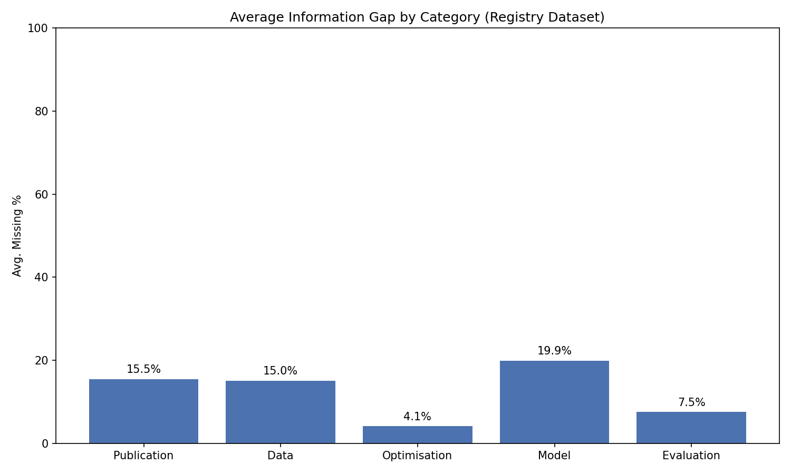

# DOME Registry Data Analysis Report
**Date:** 2026-01-15_16-42-24
**JSON Dataset:** `Copilot_v0_Processed_2025-12-04/registry_v0` (231 files)
**Metadata:** `DOME_Registry_TSV_Files/PMCIDs_DOME_Registry_Contents_2026-01-09.tsv`

## 1. Metadata Linking
- Total JSON Files: 231
- Matched to Registry Metadata: 231 (100.0%)

## 2. Title Analysis
- JSONs with 'Not enough information is available' as Title: 2
- Title Mismatches (vs Metadata): 193

### Low Similarity Title Mismatches (Ratio < 0.5)
| PMCID | JSON Title | Metadata Title | Similarity |
|---|---|---|---|
| PMC12530094 | Not enough information is available.... | ColoPola: A polarimetric imaging dataset for color... | 0.20 |
| PMC6237755 | Not enough information is available.... | Multi-omic and multi-view clustering algorithms: r... | 0.16 |
| PMC6923882 | Not enough information is available.... | Identification of lung cancer gene markers through... | 0.29 |
| PMC4315323 | Characterising and predicting haploinsufficiency i... | Performance of case-control rare copy number varia... | 0.29 |
| PMC3340366 | Predicting CpG Island Methylation States... | Linking the epigenome to the genome: correlation o... | 0.34 |
| PMC8485143 | Not enough information is available.... | Identification of Novel COVID-19 Biomarkers by Mul... | 0.28 |
| PMC8093828 | Supervised machine learning outperforms taxonomy-b... | Identifying the minimum amplicon sequence depth to... | 0.21 |
| PMC1892091 | Not enough information is available.... | Learning biophysically-motivated parameters for al... | 0.25 |
| PMC7406221 | Global RNA Decay in Cyanobacteria... | Genome-Wide Analysis of RNA Decay in the Cyanobact... | 0.48 |
| PMC7794018 | Radiomics Signature for Gastric Cancer... | Intratumoral and Peritumoral Radiomics of Contrast... | 0.33 |
| PMC5656045 | DeepBipolar: A Deep Learning Framework for Predict... | DeepBipolar: Identifying genomic mutations for bip... | 0.49 |
| PMC11899596 | Cer ebellocer ebr al connectivity predicts BMI... | Cerebellocerebral Connectivity Predicts Body Mass ... | 0.45 |
| PMC8261512 | Not enough information is available.... | A Noninvasive Multianalytical Approach for Lung Ca... | 0.28 |
| PMC6817842 | Not enough information is available.... | A reference map of murine cardiac transcription fa... | 0.29 |
| PMC5821274 | Deep Learning-Based Prediction of Drug Sensitivity... | Precision Oncology beyond Targeted Therapy: Combin... | 0.33 |
| PMC12365963 | Not enough information is available.... | CODARFE: Unlocking the prediction of continuous en... | 0.31 |
| PMC5034704 | Not enough information is available.... | Molecular Properties of Drugs Interacting with SLC... | 0.16 |
| PMC5773889 | PredRBR: A Gradient Tree Boosting-Based Method for... | A boosting approach for prediction of protein-RNA ... | 0.34 |
| PMC6036855 | Not enough information is available.... | An Extreme Learning Machine Based on Artificial Im... | 0.31 |
| PMC6436896 | Not enough information is available.... | Learning protein constitutive motifs from sequence... | 0.22 |
| ... | ... | ... | ... |

## 3. Information Coverage

| Category | Avg Missing % |
|---|---|
| Publication | 15.5% |
| Data | 15.0% |
| Optimisation | 4.1% |
| Model | 19.9% |
| Evaluation | 7.5% |
