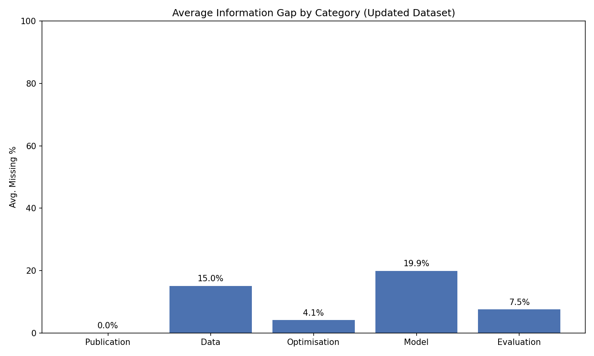

# Updated DOME Registry Data Analysis Report
**Date:** 2026-01-15_16-53-53
**JSON Dataset:** `Copilot_v0_Processed_2025-12-04_Updated_Metadata` (231 files)
**Metadata:** `DOME_Registry_TSV_Files/PMCIDs_DOME_Registry_Contents_2026-01-09.tsv`

## 1. Metadata Linking
- Total JSON Files: 231
- Matched to Registry Metadata: 231 (100.0%)

## 2. Title Analysis
- JSONs with 'Not enough information is available' as Title: 0
- Title Mismatches (vs Metadata): 97

### Low Similarity Title Mismatches (Ratio < 0.5)
| PMCID | JSON Title | Metadata Title | Similarity |
|---|---|---|---|
| PMC12087453 | Multiomics analysis of umbilical cord hematopoieti... | Multi-omics Analysis of Umbilical Cord Hematopoiet... | 0.11 |

## 3. Information Coverage

| Category | Avg Missing % |
|---|---|
| Publication | 0.0% |
| Data | 15.0% |
| Optimisation | 4.1% |
| Model | 19.9% |
| Evaluation | 7.5% |
